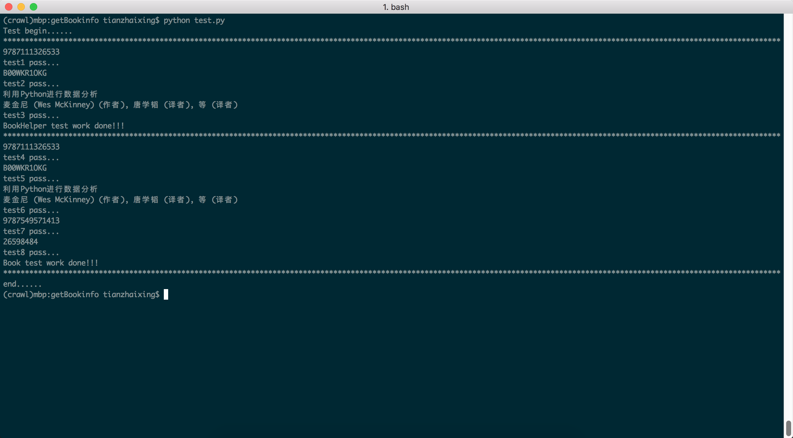

##Book Spider 


###overview
This repo is created for crawling amazon and douban book's information by Python language.


###Needs
* [python](https://www.python.org/downloads/)
* [scrapy](http://doc.scrapy.org/en/latest/)
* [requests](http://www.python-requests.org/en/latest/)


###BookHelper
In **BookHelper** class some basic methods are programed, like:

```
1. getAmazonAsinByIsbn
2. getAmazonIsbnByAsin
3. getAmazonAsinByTitleAndAuthor

```


###Book
In **Book** class some basic methods are programed, like:


```
1. getAmazonBookInforByIsbn
2. getAmazonBookInforByAsin
3. getAmazonBookInforByTitleAndAuthor
4. getDoubanBookInforByIsbnOrSubjectId

```

###Result




###Notethat

*  '.UserAgentString.json'文件里面包含有**9502**个[PC浏览器](http://www.useragentstring.com/pages/Browserlist/)代理信息和**512**个[Mobile浏览器](http://www.useragentstring.com/pages/Mobile%20Browserlist/)代理信息。
* 默认不启用[Crawlera](http://scrapinghub.com/crawlera/)Proxy服务, 需要自己设置 CRAWLERA_USER 的值。(具体如何设置CRAWLERA_USER，请参考官网)

* I use key by local user by edit the ***.bash_profile*** in user home dir, like:

```
    #in .bash_profile
    export CRAWLERA_USER=<KEY>
    #out .bash_profile
    source .bash_profile
```

* Get the **CRAWLERA_USER** by use **os** module in python language, like:

```
    import os
    userkey = os.environ.get("CRAWLERA_USER")
```

* Now you know it. By the way, **CRAWLERAKEY** is not free!
